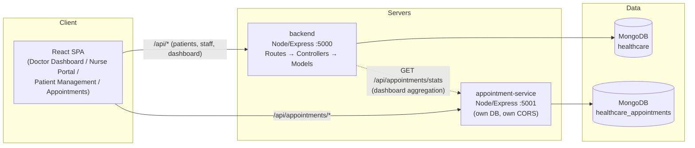
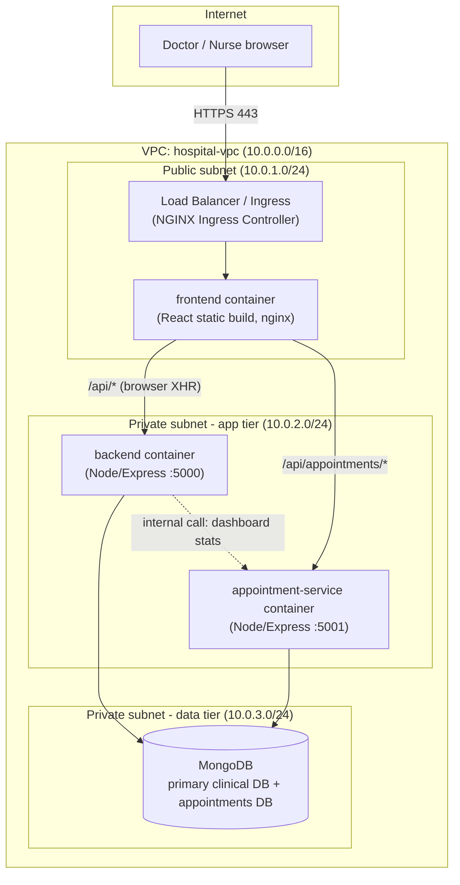

# DECI4-S-415716-Hospital-Core

## 1. Project Overview

MediCore is a full-stack hospital management system that replaces
paper-based medical files with a digital platform for doctors, nurses, and
administrators. It covers patient registration and medical records, staff
role-based workflows (doctor dashboard, nurse ward management), and
appointment scheduling, all backed by MongoDB.

The system is built as a mono-repo with the high-traffic appointment
booking feature deliberately extracted into its own microservice: booking
surges during peak scheduling hours are isolated to that service alone,
so doctor dashboards and patient records stay responsive even under load.
The project is containerized end-to-end (Docker Compose for local/dev,
Kubernetes manifests with autoscaling for production-shaped orchestration)
and ships with automated seeding, a multi-layer test suite, and a CI/CD
pipeline that runs tests, Lighthouse audits, and semantic-versioned
releases on every push.

## 2. Architecture Diagram



This diagram renders directly on GitHub. A second diagram, showing how
these same services map onto public/private cloud subnets, is in
**Section 11 — VPC Blueprint** and in full detail at
[`infra/VPC-BLUEPRINT.md`](./infra/VPC-BLUEPRINT.md).

## 3. Technology Stack

| Layer | Technology | Why it was chosen |
|---|---|---|
| Frontend framework | React 18 + Vite | Fast dev server, SPA routing via React Router, no full-page reloads between clinical workflows |
| Frontend data layer | TanStack React Query | Caches patient/appointment data across screens, background re-sync, and enables optimistic UI updates on critical forms |
| Frontend testing | Jest + React Testing Library | Standard, widely-supported unit testing for React components without a browser |
| Backend framework | Node.js + Express | Lightweight, unopinionated, easy to structure as MVC (Routes/Controllers/Models) |
| Database | MongoDB + Mongoose | Schema-flexible documents fit variable clinical records (vitals arrays, medical history) better than rigid relational tables |
| Backend/API testing | Jest + Supertest | Integration-tests real HTTP routes against a real MongoDB instance |
| Auth | JSON Web Tokens (JWT) + bcrypt | Stateless auth that both the backend and the independent appointment-service can verify locally, without a shared session store |
| Microservice isolation | Separate Express app + separate MongoDB database | Lets the appointment-service scale and fail independently of the core backend |
| Containerization | Docker (multi-stage builds) | Reproducible builds; nginx-served static frontend in production, Node dev servers in the hot-reload dev compose file |
| Local orchestration | Docker Compose | Single-command startup of the whole stack, with a separate `docker-compose.dev.yml` for live-reload development |
| Container orchestration | Kubernetes (Minikube locally) | Demonstrates real auto-scaling (HPA) and ingress routing/TLS, the way this would run in a real cluster |
| CI/CD | GitHub Actions | Native to the repo host, free for public repos, integrates cleanly with semantic-release and Lighthouse CI |
| Performance auditing | Lighthouse CI | Automated, threshold-enforced performance/accessibility/best-practices checks on every push |
| Versioning | semantic-release (Conventional Commits) | Removes manual version bumps and changelog writing; ties releases directly to commit history |
| Frontend hosting | Netlify | Free tier, zero-config static hosting with SPA rewrites for a Vite build |
| Backend hosting | Vercel (serverless) | Free tier, deploys the same Express app as a serverless function with no route code duplicated |
| Appointment-service hosting | Render | Needs a persistent long-running Node process, which Vercel/Netlify don't provide on their free static/serverless tiers |
| Production database | MongoDB Atlas | Free managed tier (M0), avoids self-hosting a database in production |

## 4. Prerequisites

Install these before doing anything else. Versions below are what this
project was built and tested against — newer patch versions are fine,
older ones may not be.

| Tool | Required version | Check with |
|---|---|---|
| Node.js | 20.x (LTS) | `node -v` |
| npm | 10.x (ships with Node 20) | `npm -v` |
| Docker Desktop | 4.30+ (Docker Engine 26+, Compose v2.27+) | `docker --version` / `docker compose version` |
| kubectl | 1.30.x | `kubectl version --client` |
| Minikube | 1.33.x | `minikube version` |
| Git | any recent version | `git --version` |

You will also need free accounts for: **GitHub**, **MongoDB Atlas**,
**Netlify**, **Vercel**, and **Render** — required only for Section 10
(Live Deployment), not for local/Kubernetes setup.

## 5. Local Setup

```bash
# 1. Clone the repo
git clone https://github.com/<your-username>/DECI4-S-415716-Hospital-Core.git
cd DECI4-S-415716-Hospital-Core

# 2. Copy environment templates (see Section 7 for what each variable means)
cp backend/.env.example backend/.env
cp microservices/appointment-service/.env.example microservices/appointment-service/.env
cp frontend/.env.example frontend/.env

# 3a. EITHER: run natively with npm (needs a local MongoDB on :27017)
npm install
npm run seed
npm run dev

# 3b. OR: run everything in Docker (Mongo included, no local install needed)
cd infra
docker compose up --build
# then, from the project root in a separate terminal, seed the DB once:
npm run seed
```

Either path serves the frontend at **http://localhost:3000**. Log in with
a seeded account — see Section 9 for how the seed data is produced, or
just use:

```
amina.doctor@hospital.test / password123   (doctor)
nour.nurse@hospital.test   / password123   (nurse)
```

For live-reload development inside Docker instead of a production-style
build, use `docker compose -f docker-compose.dev.yml up` from `infra/`.

## 6. Kubernetes Setup

```bash
# 1. Start Minikube and enable the Ingress addon
minikube start --driver=docker
minikube addons enable ingress

# 2. Point your shell's Docker client at Minikube's internal daemon
#    (Linux/macOS)
eval $(minikube docker-env)
#    (Windows PowerShell)
# & minikube docker-env --shell powershell | Invoke-Expression

# 3. Build all three images directly into Minikube (no registry push needed)
docker build -t hospital-backend:latest ./backend
docker build -t hospital-appointment-service:latest ./microservices/appointment-service
docker build -t hospital-frontend:latest ./frontend

# 4. In each infra/k8s/*-deployment.yaml, set the image: to the tag above
#    and add `imagePullPolicy: Never` so Kubernetes uses the local image.

# 5. Generate a mock TLS certificate and create the Secret the Ingress uses
openssl req -x509 -nodes -days 365 -newkey rsa:2048 \
  -keyout hospital.local.key -out hospital.local.crt \
  -subj "/CN=hospital.local/O=hospital.local"
kubectl create secret tls hospital-tls-secret \
  --cert=hospital.local.crt --key=hospital.local.key

# 6. Apply every manifest
kubectl apply -f infra/k8s/mongo-deployment.yaml
kubectl apply -f infra/k8s/backend-deployment.yaml
kubectl apply -f infra/k8s/appointment-service-deployment.yaml
kubectl apply -f infra/k8s/frontend-deployment.yaml
kubectl apply -f infra/k8s/ingress.yaml

kubectl get pods -w    # wait until everything is Running

# 7. Map hospital.local to Minikube's IP
echo "$(minikube ip) hospital.local" | sudo tee -a /etc/hosts   # Linux/macOS
# Windows: add "<minikube ip> hospital.local" as Administrator to
# C:\Windows\System32\drivers\etc\hosts

# 8. Access it
curl -k https://hospital.local/api/health
# or open https://hospital.local in a browser (accept the self-signed cert warning)
```

Full detail, including how to generate load and watch the
`HorizontalPodAutoscaler`s scale `backend` and `appointment-service`
independently, is in
[`infra/k8s/README-ingress.md`](./infra/k8s/README-ingress.md).

## 7. Environment Variables

No real values are stored anywhere in this repo — every service ships an
`.env.example` (also mirrored under
[`infra/env-templates/`](./infra/env-templates/)) that you copy to `.env`
and fill in yourself.

| Variable | Used by | Description |
|---|---|---|
| `PORT` | backend, appointment-service | Port the Express server listens on locally (hosting platforms set this themselves in production) |
| `MONGO_URI` | backend, appointment-service | MongoDB connection string. **Each service points at its own database** — they never share one |
| `JWT_SECRET` | backend, appointment-service | Must be identical in both services — the appointment-service verifies tokens issued by the backend's login route without calling back into it |
| `CLIENT_ORIGIN` | backend, appointment-service | Exact origin allowed by CORS (e.g. `http://localhost:3000` locally, your Netlify URL in production) |
| `APPOINTMENT_SERVICE_URL` | backend | Base URL the backend calls to build `/api/dashboard/stats` |
| `VITE_API_URL` | frontend | Base URL (including `/api`) for the primary backend |
| `VITE_APPOINTMENT_API_URL` | frontend | Base URL (including `/api`) for the appointment microservice |

## 8. API Documentation

Full request/response examples for every endpoint are importable directly
into Postman: [`MediCore.postman_collection.json`](./MediCore.postman_collection.json).
Summary below.

### Auth — `backend`, base `/api/auth`
| Method | Path | Body | Notes |
|---|---|---|---|
| POST | `/register` | `{ name, email, password, role, department? }` | `role` ∈ `doctor` / `nurse` / `admin` |
| POST | `/login` | `{ email, password }` | Returns `{ staff, token }` |
| GET | `/me` | — (Bearer token) | Returns the authenticated staff profile |

### Patients — `backend`, base `/api/patients` (all require Bearer token)
| Method | Path | Body / Query | Notes |
|---|---|---|---|
| GET | `/` | `?search=&ward=&status=` | List/search patients |
| POST | `/` | patient fields | doctor/nurse/admin only |
| GET | `/:id` | — | Single patient incl. vitals + medical history |
| PUT | `/:id` | partial fields | Update status, ward, etc. |
| DELETE | `/:id` | — | doctor/admin only |
| POST | `/:id/vitals` | `{ bloodPressure, heartRate, temperature, notes }` | doctor/nurse only |

### Dashboard — `backend`, base `/api/dashboard`
| Method | Path | Notes |
|---|---|---|
| GET | `/stats` | Aggregates patient/staff counts + live appointment stats; degrades gracefully if the appointment-service is unreachable |

### Appointments — `microservices/appointment-service`, base `/api/appointments`
| Method | Path | Body / Query | Notes |
|---|---|---|---|
| GET | `/stats` | — | **No auth required** — kept cheap for the dashboard's poll |
| GET | `/` | `?doctorId=&patientId=&status=&from=&to=` | Bearer token required |
| POST | `/` | `{ patientId, patientName, doctorId, doctorName, department?, scheduledAt, reason? }` | |
| GET | `/:id` | — | |
| PUT | `/:id` | partial fields | |
| POST | `/:id/cancel` | — | Sets status to `cancelled` |

## 9. Testing

```bash
# Frontend unit tests (Jest + React Testing Library)
npm run test --workspace=frontend
```
Expected when passing:
```
Test Suites: 3 passed, 3 total
Tests:       7 passed, 7 total
```

```bash
# Backend integration tests (needs MongoDB running)
npm run test --workspace=backend
```
Expected when passing:
```
PASS  tests/patient.test.js
Test Suites: 1 passed, 1 total
Tests:       4 passed, 4 total
```

```bash
# Appointment-service integration tests (needs MongoDB running)
npm run test --workspace=microservices/appointment-service
```
Expected when passing:
```
PASS  tests/appointment.test.js
Test Suites: 1 passed, 1 total
Tests:       3 passed, 3 total
```

```bash
# Cross-service E2E workflow (needs `npm run dev` running in another terminal):
# registers a patient → books an appointment → updates the record →
# confirms dashboard stats changed
npm run test:e2e
```
Expected when passing:
```
Step 1: register a doctor account and log in
  ✓ doctor registration succeeds
Step 2: read baseline dashboard stats
  ✓ dashboard stats endpoint responds
Step 3: register a new patient
  ✓ patient is created
Step 4: book the patient's appointment on the independent microservice
  ✓ appointment is booked on appointment-service
Step 5: update the patient's record (admit them)
  ✓ patient record updated to admitted
Step 6: confirm dashboard numbers changed
  ✓ total patient count incremented by one
  ✓ admitted count incremented

All workflow steps passed.
```

CI runs all four of the above automatically on every push/PR — see
`.github/workflows/test.yml`.

## 10. Live Deployment

> Fill in these URLs once deployed (see the deployment walkthrough in this
> project's setup notes for Netlify/Vercel/Render/Atlas step-by-step
> instructions). Replace the placeholders below and attach screenshots of
> each URL loading successfully in production before submission.

| Service | Platform | Live URL |
|---|---|---|
| Frontend | Netlify | `https://REPLACE-ME.netlify.app` |
| Backend API | Vercel | `https://REPLACE-ME.vercel.app/api/health` |
| Appointment microservice | Render | `https://REPLACE-ME.onrender.com/api/appointments/stats` |
| Database | MongoDB Atlas | *(private connection string — not public)* |

**Screenshots to attach:**
1. The Netlify URL open in a browser, logged in, showing the Doctor Dashboard with real data.
2. `curl https://REPLACE-ME.vercel.app/api/health` returning `{"status":"ok",...}`.
3. `curl https://REPLACE-ME.onrender.com/api/appointments/stats` returning real numbers.

## 11. VPC Blueprint



| Layer | Subnet type | Contains | Why |
|---|---|---|---|
| Edge / UI | Public | Load balancer / Ingress, `frontend` container | Only layer exposed to the internet; terminates TLS |
| Application | Private | `backend`, `appointment-service` | Runs business logic and holds JWT secrets; reachable only from the public subnet's load balancer, never directly from the internet |
| Data | Private (most restricted) | MongoDB (clinical DB + appointments DB) | Holds patient records; no route in or out except from the application subnet, no public IP ever |

Full explanation of the security-group rules and how this maps onto the
actual Kubernetes/PaaS deployment is in
[`infra/VPC-BLUEPRINT.md`](./infra/VPC-BLUEPRINT.md).
