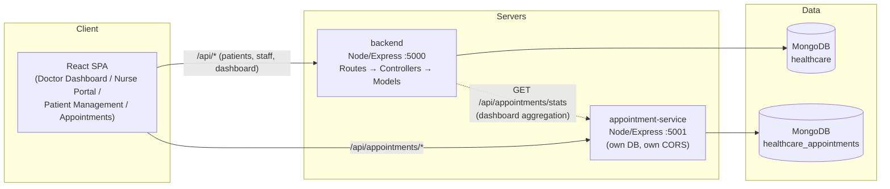

# DECI4-S-415716-Hospital-Core

A full-stack hospital management system: patient records, staff workflows,
and appointment scheduling, built on React, Node.js/Express, and MongoDB,
with appointment booking extracted into its own independently-scalable
microservice.

```
DECI4-S-415716-Hospital-Core/
├── backend/                    # Node.js core server: models, controllers, medical routes
├── frontend/                   # React SPA: doctor/nurse/patient/appointment UI
├── microservices/
│   └── appointment-service/    # Independent scheduling microservice (own DB, own CORS)
├── infra/                      # Docker Compose, Kubernetes manifests, VPC blueprint, env templates
├── tests/e2e/                  # Cross-service end-to-end workflow test
├── lighthouserc.js             # Lighthouse CI thresholds
├── .releaserc.json             # Semantic-release / changelog config
└── .github/workflows/test.yml  # CI: unit + integration + E2E tests, Lighthouse, Docker builds, release
```

## Architecture



See `infra/VPC-BLUEPRINT.md` for how this maps onto public/private subnets
in a cloud deployment.

## Why appointments are a separate service

Booking traffic spikes hard at peak scheduling hours. If appointments lived
in the main backend, a surge there would slow down or crash doctor
dashboards, patient records, and everything else sharing that process.
Splitting it out means an appointment surge is isolated to its own
container/pod, it can be scaled independently (see the `HorizontalPodAutoscaler`
in `infra/k8s/appointment-service-deployment.yaml`), and if it's ever
unhealthy, `/api/dashboard/stats` on the main backend degrades gracefully
instead of failing outright (`backend/controllers/dashboardController.js`).

## 1. Try it locally

**Prerequisites:** Node.js 20+, npm 10+, MongoDB running locally (or Docker,
see section 4) on `mongodb://localhost:27017`.

```bash
cd DECI4-S-415716-Hospital-Core
npm install

cp backend/.env.example backend/.env
cp microservices/appointment-service/.env.example microservices/appointment-service/.env
cp frontend/.env.example frontend/.env

npm run seed     # demo staff, patients (with medical history), and appointments
npm run dev      # starts backend (5000), appointment-service (5001), frontend (3000)
```

Open http://localhost:3000 and log in with a seeded account:

```
amina.doctor@hospital.test / password123   (doctor)
nour.nurse@hospital.test   / password123   (nurse)
admin@hospital.test        / password123   (admin)
```

### Running tests

```bash
# Frontend unit tests (Jest + React Testing Library)
npm run test --workspace=frontend

# Backend + appointment-service integration tests (needs Mongo running)
npm run test --workspace=backend
npm run test --workspace=microservices/appointment-service

# Cross-service E2E workflow: register patient → book appointment →
# update record → confirm dashboard stats changed. Run `npm run dev`
# in one terminal first, then in another:
npm run test:e2e
```

Import `MediCore.postman_collection.json` into Postman for manual/integration
testing of every endpoint (Auth, Patients, Dashboard, Appointments) — the
login request auto-saves its JWT into a collection variable so every
subsequent request is already authenticated.

## 2. Try it with Docker

**Production-shaped stack** (built images, nginx-served frontend):
```bash
cd infra
docker compose up --build
```

**Development stack with hot-reload** (bind-mounted source, nodemon/Vite
inside containers — edits reflect immediately, no rebuild):
```bash
cd infra
docker compose -f docker-compose.dev.yml up
```

To simulate scaling the appointment service under load, independent of
everything else:
```bash
docker compose up --scale appointment-service=3
```

## 3. Kubernetes (Minikube)

`infra/k8s/` has manifests for every service, plus `HorizontalPodAutoscaler`s
on **both** `backend` and `appointment-service` so either can scale under
load independently of the other. Full step-by-step commands — starting
Minikube, building images into its Docker daemon, generating a mock TLS
cert, creating the Secret, applying manifests, and simulating load to watch
the HPA scale pods — are in **`infra/k8s/README-ingress.md`**.

Quick summary:
```bash
minikube start
minikube addons enable ingress
eval $(minikube docker-env)
docker build -t hospital-backend:latest ./backend
docker build -t hospital-appointment-service:latest ./microservices/appointment-service
docker build -t hospital-frontend:latest ./frontend
# generate mock cert + secret (see infra/k8s/README-ingress.md), then:
kubectl apply -f infra/k8s/
curl -k https://hospital.local/api/health
```

The Ingress (`infra/k8s/ingress.yaml`) routes `hospital.local` to the
frontend and `hospital.local/api` to the backend, with TLS termination via
a Kubernetes Secret holding a mock self-signed certificate.

## 4. Deploying to production (free tier)

| Piece | Platform | Why |
|---|---|---|
| `frontend/` | **Netlify** | Static Vite build; `frontend/netlify.toml` is already configured |
| `backend/` | **Vercel** | Deployed as a serverless function via `backend/api/index.js` + `backend/vercel.json` |
| `microservices/appointment-service/` | Render (or Railway/Fly) | Needs a persistent Node process; Vercel/Netlify don't run long-lived servers, so this piece goes to a Node host |
| MongoDB | **MongoDB Atlas** | Managed, free M0 tier |

### Frontend → Netlify
1. Push this repo to GitHub.
2. Netlify → **Add new site → Import an existing project** → pick the repo.
3. Base directory: `frontend`. Build command and publish directory are
   already set via `frontend/netlify.toml` (`npm run build`, `dist`).
4. Add environment variables: `VITE_API_URL` (your Vercel backend URL +
   `/api`), `VITE_APPOINTMENT_API_URL` (your Render appointment-service URL +
   `/api`).
5. Deploy. You'll get a `https://your-site.netlify.app` URL.

### Backend → Vercel
1. Vercel → **New Project** → import the repo → **Root Directory:** `backend`.
2. Vercel auto-detects `backend/vercel.json`, which routes every request to
   `backend/api/index.js` (a serverless wrapper around the same Express app
   used locally — no route code duplicated).
3. Env vars: `MONGO_URI` (Atlas connection string), `JWT_SECRET`,
   `APPOINTMENT_SERVICE_URL` (fill in after the next step), `CLIENT_ORIGIN`
   (your Netlify URL).
4. Deploy.

### Appointment service → Render
1. Render → **New Web Service** → root directory
   `microservices/appointment-service` → build `npm install` → start
   `npm start`.
2. Env vars: its own `MONGO_URI`, same `JWT_SECRET` as the backend,
   `CLIENT_ORIGIN` set to your Netlify URL.
3. Once live, copy its URL back into the Vercel backend's
   `APPOINTMENT_SERVICE_URL` and redeploy.

### MongoDB → Atlas
Create a free M0 cluster, add a database user, allow network access from
`0.0.0.0/0` (or Vercel/Render's IP ranges), and use the connection string in
both the backend and appointment-service env vars (as two different
database names on the same cluster, or two separate clusters).

### Seed production data
Temporarily point your local `.env` files' `MONGO_URI` at the Atlas
connection strings and run `npm run seed` once from your machine.

## Environment variables

| Variable | Used by | Description |
|---|---|---|
| `PORT` | backend, appointment-service | Port the Express server listens on locally (Vercel/Render set this themselves in production) |
| `MONGO_URI` | backend, appointment-service | MongoDB connection string. **Each service uses its own database** — they do not share one |
| `JWT_SECRET` | backend, appointment-service | Must be the **same value in both services** — the appointment-service verifies tokens issued by the backend's `/api/auth/login` without calling back into it |
| `CLIENT_ORIGIN` | backend, appointment-service | Exact origin allowed by CORS (e.g. `http://localhost:3000` locally, your Netlify URL in production) |
| `APPOINTMENT_SERVICE_URL` | backend | Base URL the backend calls for `/api/appointments/stats` when building the dashboard |
| `VITE_API_URL` | frontend | Base URL (incl. `/api`) for the primary backend |
| `VITE_APPOINTMENT_API_URL` | frontend | Base URL (incl. `/api`) for the appointment microservice |

Copies of every service's `.env.example` are also collected in
`infra/env-templates/` for convenience.

## API reference

### Auth (`backend`, base `/api/auth`)
| Method | Path | Body | Notes |
|---|---|---|---|
| POST | `/register` | `{ name, email, password, role, department? }` | `role` ∈ doctor/nurse/admin |
| POST | `/login` | `{ email, password }` | Returns `{ staff, token }` |
| GET | `/me` | — (Bearer token) | Returns the authenticated staff profile |

### Patients (`backend`, base `/api/patients`, all require Bearer token)
| Method | Path | Body / Query | Notes |
|---|---|---|---|
| GET | `/` | `?search=&ward=&status=` | List/search patients |
| POST | `/` | patient fields | doctor/nurse/admin only |
| GET | `/:id` | — | Single patient incl. vitals + history |
| PUT | `/:id` | partial fields | Update status, ward, etc. |
| DELETE | `/:id` | — | doctor/admin only |
| POST | `/:id/vitals` | `{ bloodPressure, heartRate, temperature, notes }` | doctor/nurse only |

### Dashboard (`backend`, base `/api/dashboard`)
| Method | Path | Notes |
|---|---|---|
| GET | `/stats` | Aggregates patient/staff counts + live appointment stats; degrades gracefully if appointment-service is down |

### Appointments (`microservices/appointment-service`, base `/api/appointments`)
| Method | Path | Body / Query | Notes |
|---|---|---|---|
| GET | `/stats` | — | **No auth required** — kept cheap for the dashboard poll |
| GET | `/` | `?doctorId=&patientId=&status=&from=&to=` | Bearer token required |
| POST | `/` | `{ patientId, patientName, doctorId, doctorName, department?, scheduledAt, reason? }` | |
| GET | `/:id` | — | |
| PUT | `/:id` | partial fields | |
| POST | `/:id/cancel` | — | Sets status to `cancelled` |

Full request/response examples are in `MediCore.postman_collection.json`.

## CI/CD (`.github/workflows/test.yml`)

On every push/PR to `main`:
1. Installs all npm workspaces.
2. Runs **frontend Jest/RTL unit tests**.
3. Runs **backend and appointment-service integration tests** against a
   throwaway MongoDB service container.
4. Builds the frontend and runs **Lighthouse CI** (`lighthouserc.js`)
   against the static build, enforcing minimum Performance/Accessibility/
   Best Practices scores — the job fails if any threshold isn't met.
5. Builds all three Docker images to catch Dockerfile regressions.
6. On pushes to `main` only: runs **semantic-release**, which reads
   [Conventional Commits](https://www.conventionalcommits.org/) messages to
   bump the version, regenerate `CHANGELOG.md`, and cut a GitHub release
   automatically.

## Frontend data layer

The React app uses **TanStack React Query** (`frontend/src/hooks/`) instead
of ad-hoc `useEffect` fetching:
- Queries are cached and shared across screens (e.g. patient list data isn't
  re-fetched every time you switch tabs), with background re-sync.
- **Optimistic UI updates** on the critical clinical forms — updating a
  patient's status/ward in the Nurse Portal, and booking/cancelling an
  appointment — apply the change to the local cache immediately and roll
  back automatically if the server rejects it, so staff never wait on
  network latency mid-workflow.

## Latest Update

Added deployment documentation.