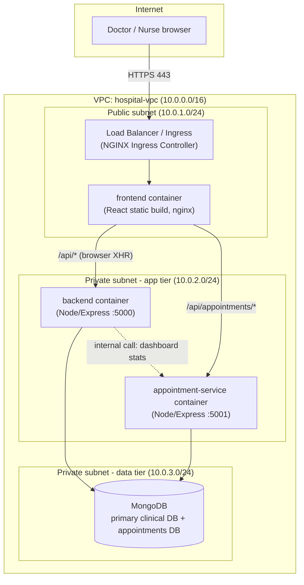

# Conceptual VPC & Subnet Blueprint

This maps the containers in this project onto a Virtual Private Cloud (VPC)
topology, separating public-facing UI traffic from private clinical-data
access.

## Subnet responsibilities

| Layer | Subnet type | Contains | Why |
|---|---|---|---|
| Edge / UI | Public | Load balancer / Ingress, `frontend` container | Only layer exposed to the internet. Serves static assets and terminates TLS. |
| Application | Private | `backend`, `appointment-service` | Runs business logic and holds JWT secrets. Never reachable directly from the internet — only from the public subnet's load balancer/ingress, or from the frontend's browser calls proxied through it. |
| Data | Private (most restricted) | MongoDB (clinical DB + appointments DB) | Holds patient records. No route in or out except from the application subnet. No public IP, ever. |

## Security group / firewall rules (conceptual)

- **Public subnet → Internet:** inbound 443 (HTTPS) only, outbound anything.
- **Application subnet:** inbound only from the public subnet's load balancer on ports 5000/5001. No direct inbound from the internet. Outbound to the data subnet on port 27017 and to the internet for none (all clinical data stays internal).
- **Data subnet:** inbound only from the application subnet on port 27017. No outbound to the internet at all.

## Why the appointment-service gets its own path, not its own subnet

Both `backend` and `appointment-service` sit in the same private application
subnet because they have identical trust requirements (internal-only,
talk to the data subnet, no direct internet exposure). What separates them
operationally is not network segmentation but **independent scaling**: the
Ingress routes `/api/appointments/*` to the appointment-service's Service,
which can have its own replica count/HPA, independent of the backend's.

## Mapping to the actual deployment

- Public subnet's load balancer = the Ingress Controller in `infra/k8s/ingress.yaml` (or Netlify's CDN edge, in the PaaS deployment).
- Application subnet = the `backend` and `appointment-service` Kubernetes Deployments/Services (or the Vercel/Render deployments, in the PaaS deployment).
- Data subnet = the MongoDB Deployment/PVC in `infra/k8s/mongo-deployment.yaml` (or MongoDB Atlas's own private network, in production).
